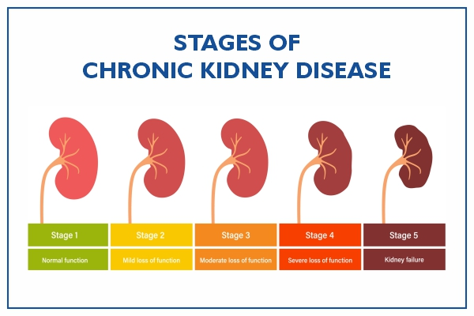

## ## Kidney-Disease-Classification-using-Deep-Learning



## Workflow

1. Create folder using python script
2. maintain setup.py 
3. maintain requirement.txt
4. run requirement.txt
5. Update config.yaml
6. Update secrets.yaml [Optional]
7. Update params.yaml
8. Update the entity
9. Update the configuration manager in src config
10. Update the components
11. Update the pipeline
12. Update the main.py
13. Update the dvc.yaml
14. app.py

## comand for creating virtual environments
```
conda craete -p env python=3.8 -y
```

## comand for installing libraries
```
pip install -r requirements.txt
```
